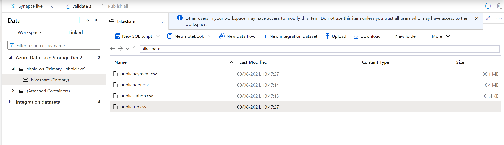
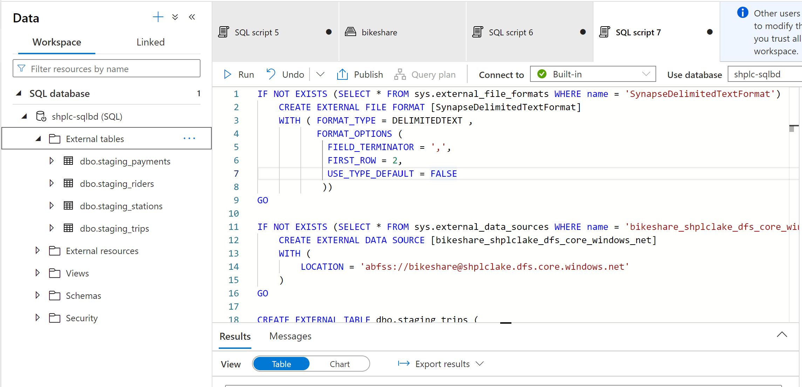
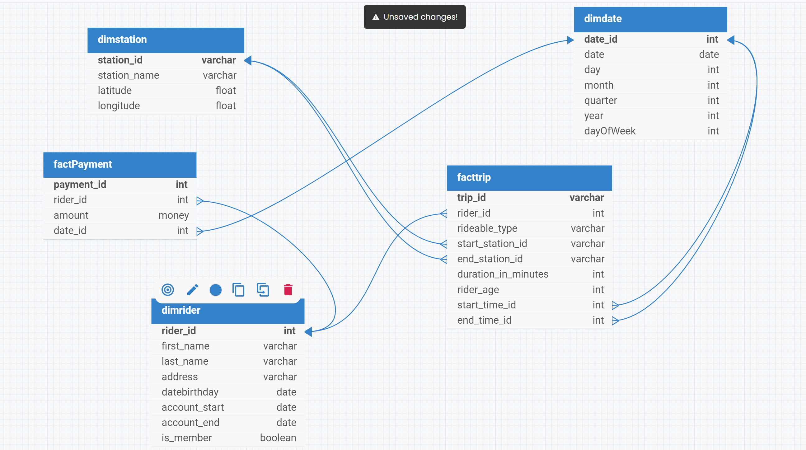
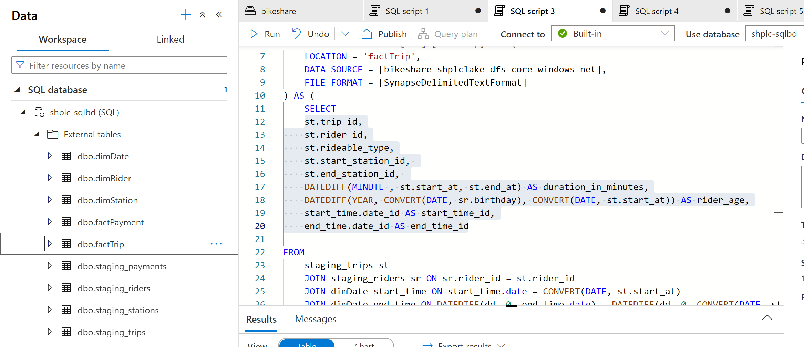

# Building an Azure Data Warehouse for Bike Share

## Project Overview
Divvy is a bike sharing program in Chicago, Illinois USA that allows riders to purchase a pass at a kiosk or use a mobile application to unlock a bike at stations around the city and use the bike for a specified amount of time. The bikes can be returned to the same station or to another station. The City of Chicago makes the anonymized bike trip data publicly available for projects like this where we can analyze the data.

Since the data from Divvy are anonymous, we have created fake rider and account profiles along with fake payment data to go along with the data from Divvy. The dataset looks like this:

## The Goal 

The goal of this project is to develop a data warehouse solution using Azure Synapse Analytics. This will include: 

    - Import the data into Synapse;
    - Design a star schema based on the business outcomes listed below;

        + Analyze how much time is spent per ride
        + Based on date and time factors such as day of week and time of day
        + Based on which station is the starting and / or ending station
        + Based on age of the rider at time of the ride
        + Based on whether the rider is a member or a casual rider
        + Analyze how much money is spent
        + Per month, quarter, year
        + Per member, based on the age of the rider at account start

### Steps To Reproduce The project

1. Create Infrastructure Resources

    - Create Azure Synapse Workspace
    - Create Azure PostgreSQL Data Base

2. Load Data onto Azure SQL Data Base

    - Use the follwoing command to load the local resource on to Azure SQL database after updating the files 
      with the SQL database details

        `python move-data-to-postgres.py`

3. Ingest data from Azure PostgreSQL to Azure Blod Storage

    - Ingest the data using the Ingest wizard tool provided in Synapse studio

      

4. Load data from Blob Storage to External Tables in Synapse Data Warehouse

    - Use the SQL scripts provided in the 'load external tables' folder to create the external tables

      

5. Data Modeling

    - Use the scripts provided in the 'data modeling' folder to create following star schema

      
    
    - The dimensional and fact tables created are depicted below

      

